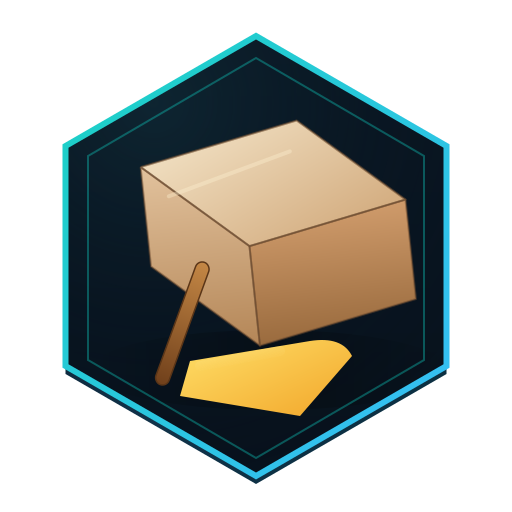

<p align="center">
  
</p>

# ChzEx

[](https://hex.pm/packages/chz_ex)
[](https://hexdocs.pm/chz_ex)
[](https://github.com/North-Shore-AI/chz_ex/actions)

Configuration management with CLI parsing for Elixir.

ChzEx is a native Elixir port of OpenAI's [chz](https://github.com/openai/chz) Python library, providing:

- **Typed configuration schemas** with compile-time validation
- **CLI argument parsing** (`name=value`, `model.layers=12`)
- **Polymorphic construction** - specify factory and arguments at runtime
- **Wildcards** (`...n_layers=100` sets all matching fields)
- **References** (`target@=source` copies values between fields)
- **Excellent error UX** with suggestions and source tracking

## Installation

Add `chz_ex` to your dependencies in `mix.exs`:

```elixir
def deps do
  [
    {:chz_ex, "~> 0.1.0"}
  ]
end
```

## Quick Start

### Define a Schema

```elixir
defmodule MyApp.Config do
  use ChzEx.Schema

  chz_schema do
    field :name, :string, doc: "Experiment name"
    field :learning_rate, :float, default: 0.001
    field :batch_size, :integer, default: 32
  end
end
```

### Parse from CLI

```elixir
# In your script or mix task
case ChzEx.entrypoint(MyApp.Config) do
  {:ok, config} ->
    IO.puts("Training with: #{inspect(config)}")

  {:error, error} ->
    IO.puts(:stderr, "Error: #{error}")
    System.halt(1)
end
```

Run with:

```bash
mix run train.exs -- name=experiment1 learning_rate=0.0001
```

### Nested Configuration

```elixir
defmodule MyApp.ModelConfig do
  use ChzEx.Schema

  chz_schema do
    field :hidden_dim, :integer, default: 768
    field :num_layers, :integer, default: 12
  end
end

defmodule MyApp.Config do
  use ChzEx.Schema

  chz_schema do
    field :name, :string
    embeds_one :model, MyApp.ModelConfig
  end
end
```

CLI: `name=exp model.hidden_dim=256 model.num_layers=6`

### Polymorphic Construction

```elixir
defmodule MyApp.Optimizer do
  use ChzEx.Schema
  chz_schema do
    field :lr, :float, default: 0.001
  end
end

defmodule MyApp.Adam do
  use ChzEx.Schema
  chz_schema do
    field :lr, :float, default: 0.001
    field :beta1, :float, default: 0.9
  end
end

defmodule MyApp.SGD do
  use ChzEx.Schema
  chz_schema do
    field :lr, :float, default: 0.01
    field :momentum, :float, default: 0.9
  end
end

# Register at startup
ChzEx.Registry.register(:optimizers, "adam", MyApp.Adam)
ChzEx.Registry.register(:optimizers, "sgd", MyApp.SGD)

defmodule MyApp.Config do
  use ChzEx.Schema

  chz_schema do
    field :name, :string
    embeds_one :optimizer, MyApp.Optimizer,
      polymorphic: true,
      namespace: :optimizers,
      blueprint_unspecified: MyApp.Adam
  end
end
```

CLI: `name=exp optimizer=sgd optimizer.momentum=0.99`

### Wildcards

Set all matching fields at once:

```bash
mix run train.exs -- name=exp ...activation=gelu ...dropout=0.1
```

### References

Copy values between fields:

```elixir
ChzEx.Blueprint.new(MyApp.Config)
|> ChzEx.Blueprint.apply(%{
  "base_dim" => 768,
  "hidden_dim" => ChzEx.Blueprint.Reference.new("base_dim")
})
```

### Validation

```elixir
defmodule MyApp.Config do
  use ChzEx.Schema

  chz_schema do
    field :value, :integer, validator: [
      ChzEx.Validator.gt(0),
      ChzEx.Validator.lt(100)
    ]
  end

  @chz_validate :check_constraints
  def check_constraints(struct) do
    if struct.value > 50 do
      {:error, :value, "too high for this context"}
    else
      :ok
    end
  end
end
```

## Documentation

- [Getting Started Guide](docs/guides/getting_started.md)
- [CLI Parsing](docs/guides/cli_parsing.md)
- [Polymorphism](docs/guides/polymorphism.md)
- [Validation](docs/guides/validation.md)
- [API Reference](https://hexdocs.pm/chz_ex)

## Examples

See the [examples](https://github.com/North-Shore-AI/chz_ex/tree/main/examples) directory for complete working examples.

```bash
cd examples
./run_all.sh
```

## License

MIT License - see [LICENSE](https://github.com/North-Shore-AI/chz_ex/blob/main/LICENSE) for details.

## Acknowledgments

ChzEx is a port of [OpenAI's chz library](https://github.com/openai/chz).
